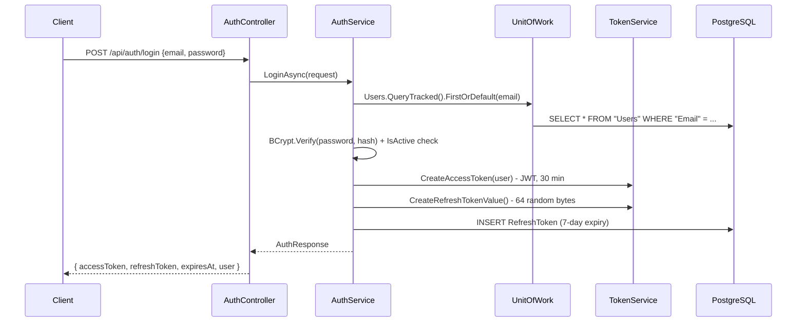
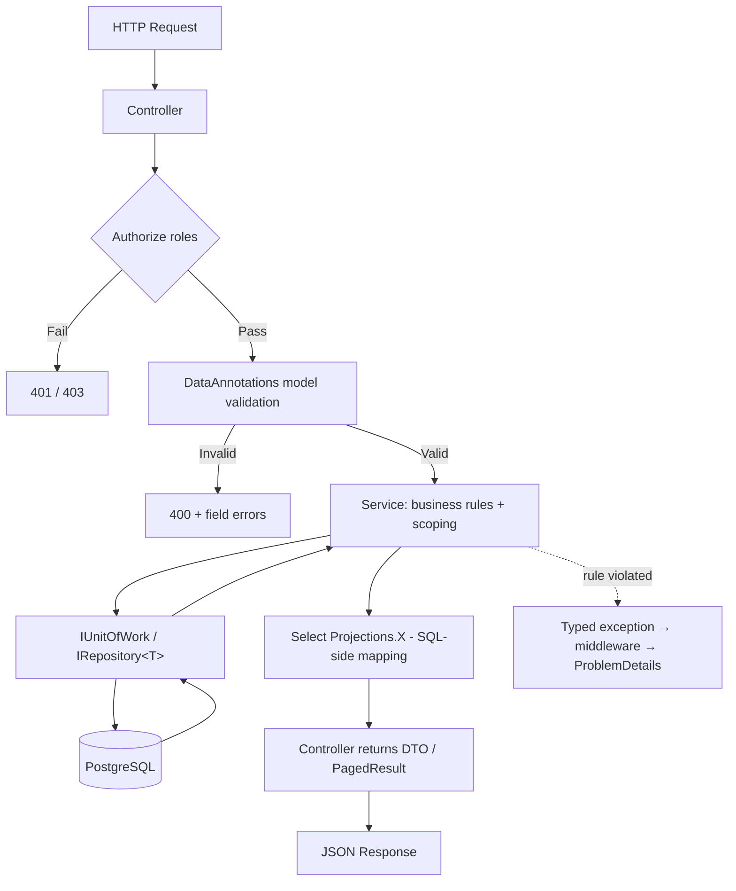
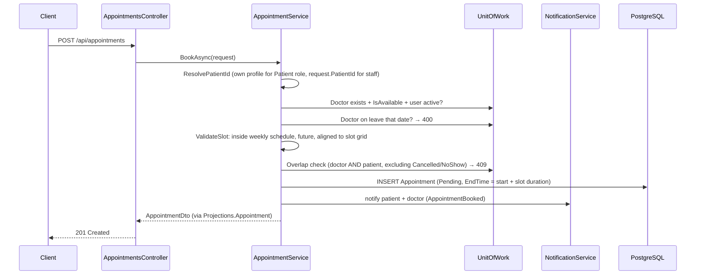

# HAPM - Architecture & Flow Guide

This document explains how the application is structured, how a request travels through the system, and how each major feature works end-to-end.

---

## Table of Contents

1. [High-Level Overview](#1-high-level-overview)
2. [Solution Structure](#2-solution-structure)
3. [Layered Architecture](#3-layered-architecture)
4. [Dependency Injection & Startup](#4-dependency-injection--startup)
5. [HTTP Request Pipeline](#5-http-request-pipeline)
6. [Error Handling & Response Shapes](#6-error-handling--response-shapes)
7. [Authentication & Authorization Flow](#7-authentication--authorization-flow)
8. [Generic Request Flow (CRUD)](#8-generic-request-flow-crud)
9. [Feature Flows](#9-feature-flows)
10. [Database Architecture](#10-database-architecture)
11. [Background Services](#11-background-services)
12. [Cross-Cutting Concerns](#12-cross-cutting-concerns)
13. [How to Trace Any Feature](#13-how-to-trace-any-feature)
14. [Future Extensions](#14-future-extensions)

---

## 1. High-Level Overview

The system is a **layered ASP.NET Core 8 Web API** backed by **PostgreSQL**. A single API process handles all HTTP traffic; the database runs as a separate service.

```
┌──────────────────┐         ┌─────────────────────────────┐         ┌──────────────┐
│  Client          │  HTTP   │  HAPM.API                   │   SQL   │  PostgreSQL  │
│  (Swagger /      │ ──────► │  + HAPM.Application         │ ──────► │  hapm_db     │
│   curl /         │         │  + HAPM.Infrastructure      │         │              │
│   Angular*)      │ ◄────── │  (single process)           │ ◄────── │              │
└──────────────────┘         └─────────────────────────────┘         └──────────────┘
                                      │
                                      ▼
                              uploads/lab-reports/   (report files on disk)

* Angular frontend is planned but not implemented yet.
```

### Architecture type

| Term | Applies? | Explanation |
|------|----------|-------------|
| **Layered architecture** | Yes | Domain, Application, Infrastructure, API projects |
| **Clean architecture** | Largely | Domain has zero dependencies; dependencies point inward; Application defines interfaces that Infrastructure implements |
| **Multi-tier (physical)** | Partially | API and DB can run on separate servers, single API app |
| **Microservices** | No | Single monolithic API |

---

## 2. Solution Structure

```
HAPM/
│
├── HAPM.slnx
├── src/
│   ├── HAPM.Domain/           ← Entities, enums (no dependencies)
│   ├── HAPM.Application/      ← Services, DTOs, projections, interfaces
│   ├── HAPM.Infrastructure/   ← EF Core, repositories, JWT, files, jobs
│   └── HAPM.API/              ← Controllers, middleware, Program.cs
│
├── docs/                      ← This documentation
├── smoke-test.ps1             ← End-to-end test (core flows)
└── smoke-test-v2.ps1          ← End-to-end test (clinical/ops features)
```

### Project dependency graph

```
HAPM.API
    └── references → HAPM.Infrastructure
                          └── references → HAPM.Application
                                                └── references → HAPM.Domain
```

**Rule:** outer layers depend on inner layers. `HAPM.Domain` never references anything. `HAPM.Application` defines the contracts (`IUnitOfWork`, `ITokenService`, `IFileStorageService`, …) that `HAPM.Infrastructure` implements.

---

## 3. Layered Architecture

### 3.1 Domain Layer (`HAPM.Domain`)

**Purpose:** define what the business *is* - not how it is stored or exposed.

| Folder | Contents |
|--------|----------|
| `Entities/` | `User`, `Doctor`, `DoctorSchedule`, `DoctorLeave`, `Patient`, `Appointment`, `VitalSign`, `Prescription(+Item)`, `PrescriptionTemplate(+Item)`, `LabReport`, `Invoice(+Item)`, `Payment`, `DoctorReview`, `WaitlistEntry`, `Notification`, `RefreshToken`, `AuditLog` |
| `Enums/` | `UserRole`, `Gender`, `AppointmentStatus`, `InvoiceStatus`, `PaymentMethod`, `LabReportStatus`, `NotificationType`, `WaitlistStatus`, `AuditAction` |
| `Common/` | `BaseEntity` |

**Key concept - `BaseEntity`:** every entity inherits

```
Id (int), CreatedAtUtc, UpdatedAtUtc
```

`UpdatedAtUtc` is stamped automatically in `AppDbContext.SaveChangesAsync`.

### 3.2 Application Layer (`HAPM.Application`)

**Purpose:** business rules, orchestration and contracts. No HTTP, no SQL strings.

| Folder | Contents |
|--------|----------|
| `Interfaces/` | `IRepository<T>` + `IUnitOfWork`, service contracts (`IAuthService`, `IAppointmentService`, …), infrastructure contracts (`ITokenService`, `IPasswordHasher`, `IFileStorageService`, `ICurrentUserService`) |
| `Services/` | All business logic implementations (Auth, User, Doctor, DoctorLeave, Patient, Appointment, Prescription, PrescriptionTemplate, VitalSign, LabReport, Billing, Review, Waitlist, Notification, Dashboard, AuditLog, Export) |
| `DTOs/` | Request classes (DataAnnotations validation) + response records, one file per module |
| `Mapping/Projections.cs` | EF-translatable `Expression<Func<Entity, Dto>>` used in `Select()` - single source of truth for entity→DTO shapes |
| `Common/` | `PagedResult<T>`, `PaginationParams`, `ToPagedResultAsync()`, typed exceptions (`NotFoundException`, `BadRequestException`, `ConflictException`, `ForbiddenException`, `UnauthorizedException`) |

**Why DTOs + projections?** Entities map to tables; DTOs map to API contracts. Projections run *inside* SQL (no over-fetching) and keep mapping logic in one place without AutoMapper.

### 3.3 Infrastructure Layer (`HAPM.Infrastructure`)

**Purpose:** all external concerns - database, security primitives, files, background work.

| Folder | Contents |
|--------|----------|
| `Persistence/` | `AppDbContext` (fluent configs inline), `Repository<T>` + `UnitOfWork`, `DbSeeder`, EF `Migrations/` |
| `Auth/` | `TokenService` (JWT + refresh token values), `BcryptPasswordHasher`, `JwtSettings` |
| `Auditing/` | `AuditSaveChangesInterceptor` - writes `AuditLog` rows on every save |
| `Storage/` | `LocalFileStorageService` (path-traversal-safe; swap target for Azure Blob) |
| `BackgroundJobs/` | `AppointmentReminderService` (hosted service) |
| `DependencyInjection.cs` | Registers DbContext + interceptor, UoW, token/hashing/storage services, hosted job |

### 3.4 API Layer (`HAPM.API`)

**Purpose:** HTTP boundary.

| Folder | Contents |
|--------|----------|
| `Controllers/` | 16 thin controllers - read input, call one service method, return result |
| `Middleware/` | `ExceptionHandlingMiddleware` → `ProblemDetails` |
| `Security/` | `CurrentUserService` (claims → typed user), `Roles` constants |
| `Program.cs` | Serilog, DI, JWT bearer, rate limiter, health checks, Swagger, CORS, migration+seed at startup |

**Controller rule:** controllers never contain business logic. Authorization is two-layered - `[Authorize(Roles = ...)]` for coarse role gates, service-level checks for ownership/scoping.

---

## 4. Dependency Injection & Startup

### 4.1 Startup order (`Program.cs`)

```
1. Serilog (console + rolling file)
2. AddApplication()        → all business services (scoped)
3. AddInfrastructure()     → DbContext (+ audit interceptor), UoW, JWT, BCrypt, file storage, reminder job
4. AddHttpContextAccessor + ICurrentUserService
5. AddControllers (+ string enum JSON converter)
6. JWT bearer authentication + authorization
7. Rate limiter (global per-IP + "auth" policy)
8. Health checks (DbContext check)
9. CORS ("Frontend" policy)
10. Swagger (with Bearer security scheme)
11. - app.Build() -
12. Migrate + seed database (logged, non-fatal if DB down)
13. Middleware pipeline (see §5)
```

### 4.2 What gets registered where

**Infrastructure (`HAPM.Infrastructure/DependencyInjection.cs`):**

```
AppDbContext (Npgsql + AuditSaveChangesInterceptor)
IUnitOfWork            → UnitOfWork          (exposes IRepository<T> per aggregate)
ITokenService          → TokenService
IPasswordHasher        → BcryptPasswordHasher    (singleton)
IFileStorageService    → LocalFileStorageService (singleton)
IHostedService         → AppointmentReminderService
```

**Application (`HAPM.Application/DependencyInjection.cs`):**

```
IAuthService, IUserService, IDoctorService, IDoctorLeaveService,
IPatientService, IAppointmentService, IPrescriptionService,
IPrescriptionTemplateService, IVitalSignService, ILabReportService,
IBillingService, IReviewService, IWaitlistService, INotificationService,
IDashboardService, IAuditLogService, IExportService     (all scoped)
```

**API (`Program.cs`):** `ICurrentUserService → CurrentUserService` (scoped, reads JWT claims).

### 4.3 Scoped lifetime

Services, repositories and the DbContext are **scoped** - one instance per HTTP request. A request shares one DbContext/UnitOfWork, so a single `SaveChangesAsync` commits the whole operation atomically; nothing leaks between concurrent requests.

---

## 5. HTTP Request Pipeline

```
Incoming HTTP Request
        │
        ▼
┌──────────────────────────┐
│ ExceptionHandling        │  ← outermost: converts exceptions to ProblemDetails
└─────────┬────────────────┘
          ▼
┌──────────────────────────┐
│ Serilog request logging  │  ← method, path, status, duration
└─────────┬────────────────┘
          ▼
┌──────────────────────────┐
│ Swagger (UI + JSON)      │
└─────────┬────────────────┘
          ▼
┌──────────────────────────┐
│ UseCors ("Frontend")     │
└─────────┬────────────────┘
          ▼
┌──────────────────────────┐
│ UseRateLimiter           │  ← 300/min per IP global; 10/min on /api/auth/*  → 429
└─────────┬────────────────┘
          ▼
┌──────────────────────────┐
│ UseAuthentication        │  ← validates JWT, populates HttpContext.User
└─────────┬────────────────┘
          ▼
┌──────────────────────────┐
│ UseAuthorization         │  ← [Authorize(Roles=...)] checks
└─────────┬────────────────┘
          ▼
┌──────────────────────────┐
│ Controller action        │  ← model validation (DataAnnotations) then service call
└─────────┬────────────────┘
          ▼
     JSON Response          (/health and /health/live mapped alongside controllers)
```

---

## 6. Error Handling & Response Shapes

`ExceptionHandlingMiddleware` maps typed Application exceptions to RFC-7807 **`ProblemDetails`**:

| Exception | HTTP Status |
|-----------|-------------|
| `BadRequestException` | 400 |
| `UnauthorizedException` | 401 |
| `ForbiddenException` | 403 |
| `NotFoundException` | 404 |
| `ConflictException` | 409 |
| (rate limiter) | 429 |
| Anything else | 500 (generic message; full details logged) |

```json
{
  "status": 409,
  "title": "Conflict",
  "detail": "The doctor already has an appointment in this time slot.",
  "instance": "/api/appointments"
}
```

Invalid models (DataAnnotations) are rejected by `[ApiController]` with the standard 400 validation problem response. Paginated lists return `PagedResult<T>` directly:

```json
{ "items": [], "page": 1, "pageSize": 10, "totalCount": 42, "totalPages": 5, "hasPrevious": false, "hasNext": true }
```

---

## 7. Authentication & Authorization Flow

### 7.1 Login flow



### 7.2 JWT claims

| Claim | Example |
|-------|---------|
| `sub` | `1` (user id) |
| `email` | `admin@hapm.local` |
| `name` | `System Administrator` |
| `role` | `Admin` |
| `jti` | random GUID per token |

### 7.3 Refresh token rotation

```
POST /api/auth/refresh { refreshToken }
    → token looked up; must be unexpired and unrevoked, user active
    → old token revoked (RevokedAtUtc) and linked (ReplacedByToken)
    → brand-new access + refresh pair issued
```

Logout revokes the supplied token; deactivating a user revokes **all** their active tokens.

### 7.4 Role gates (controller level)

`Roles` constants compose the four roles: `Staff` = Admin+Receptionist, `Clinical` = Staff+Doctor.

```csharp
[Authorize(Roles = Roles.Admin)]      // user management, audit logs, dashboard
[Authorize(Roles = Roles.Staff)]      // billing, exports, walk-in registration
[Authorize(Roles = Roles.Clinical)]   // confirm/check-in/complete, uploads, vitals
```

### 7.5 "Own resource" scoping (service level)

Role gates aren't enough - a patient must not read *another patient's* records. Every read service applies a scope filter derived from `ICurrentUserService`:

```
ScopeToCurrentUserAsync(query):
    Patient → query.Where(x => x.PatientId == myPatientId)
    Doctor  → query.Where(x => x.DoctorId == myDoctorId)
    Staff   → query unchanged
```

Used by appointments, prescriptions, vitals, lab reports, invoices and waitlist. Mutations check ownership explicitly (e.g. only the prescribing doctor can update a prescription; patients can only cancel their own appointment).

---

## 8. Generic Request Flow (CRUD)



### Layer responsibilities in one request

| Step | Layer | Example |
|------|-------|---------|
| Receive HTTP | API | `PatientsController.GetAll([FromQuery] PatientQueryParams)` |
| Validate input | Application DTOs | `[Required]`, `[Range]`, `[MaxLength]` attributes |
| Business rules | Application | `PatientService.CreateAsync` - duplicate email check, MRN generation |
| Query database | Infrastructure | `Repository<Patient>.Query()` (no-tracking IQueryable) |
| Map result | Application | `.Select(Projections.Patient)` - runs in SQL |
| Return JSON | API | `Ok(result)` / `CreatedAtAction(...)` |

---

## 9. Feature Flows

### 9.1 Book an appointment (full flow)



**Business rules enforced in `AppointmentService`:**
1. Patient and doctor must exist; doctor available and active
2. Date/time must be in the future and inside the doctor's consulting hours for that weekday
3. Start time must align to the slot grid (e.g. 09:00, 09:30 for 30-min slots)
4. Doctor must not be on leave
5. Neither the doctor nor the patient may have an overlapping active appointment

### 9.2 Appointment lifecycle → notifications

```
POST /{id}/confirm    Pending → Confirmed        (doctor own / staff)   → notify patient
POST /{id}/check-in   Confirmed → CheckedIn      (doctor own / staff)
POST /{id}/complete   Confirmed|CheckedIn → Completed (+ notes) → notify patient (AppointmentCompleted)
POST /{id}/cancel     any non-terminal → Cancelled (+ reason)           → notify both + waitlist
POST /{id}/no-show    Pending|Confirmed (past) → NoShow
PUT  /{id}/reschedule Pending|Confirmed → revalidated slot, back to Pending, reminder flag reset
```

Illegal transitions return **409** with the current status in the message.

### 9.3 Doctor leave vs. slot engine

```
PUT  /api/doctors/{id}/schedules     weekly template (validated: start<end, no same-day overlap)
POST /api/doctors/{id}/leaves        absence window
        ├── overlap with existing leave → 409
        └── active appointments in range → 409 ("cancel or reschedule them first")

GET /api/doctors/{id}/available-slots?date=
    schedule windows for that weekday
        − leave check (on leave → empty list)
        − booked overlapping appointments
        − past times (if date = today)
    = bookable slots
```

### 9.4 Waitlist flow

```
POST /api/waitlist { doctorId, preferredDate }      (duplicate active entry → 409)
        ...
Appointment cancelled for that doctor+date
    → AppointmentService.NotifyWaitlistedPatientsAsync()
        ├── all Active entries for doctor+date (excluding the cancelling patient)
        ├── each patient notified: "A slot opened up ..."
        └── entries marked Notified (+NotifiedAtUtc)
```

### 9.5 Prescription flow (Doctor only)

```
(optional) GET /api/prescription-templates/{id}   ← doctor prefills from a saved template
    │
    ▼
POST /api/prescriptions  [Authorize: Doctor]
    ├── Resolve doctor profile from JWT user id
    ├── Appointment must belong to this doctor          → 403
    ├── Appointment must be CheckedIn or Completed      → 409
    ├── No existing prescription (1-to-1 rule)          → 409
    ├── INSERT Prescription + PrescriptionItems
    └── Notify patient (PrescriptionIssued)
```

**Prescription templates** (`/api/prescription-templates`) are doctor-private presets (name unique per doctor). Applying one is purely client-side - fetch, prefill, adjust, submit normally. If `followUpDate` is set on the prescription, the background job later sends a `FollowUpDue` notification (see §11).

### 9.6 Vitals flow

```
POST /api/vitals  [Clinical roles]
    ├── Appointment exists, not Cancelled/NoShow
    ├── At least one reading present → else 400
    ├── PatientId denormalized from the appointment
    └── BMI computed in the projection: weight / (height/100)²  → rounded to 1 dp
```

### 9.7 Lab report upload flow

```
POST /api/lab-reports  (multipart/form-data)  [Clinical roles]
    │
    ▼
LabReportService.UploadAsync()
    ├── Size ≤ 10 MB, extension ∈ {.pdf .jpg .jpeg .png .dcm}
    ├── Patient (and optional doctor/appointment) validated
    ├── IFileStorageService.SaveAsync() → uploads/lab-reports/{guid}.ext
    ├── INSERT LabReport (file metadata + StoredFilePath)
    └── Notify patient (LabReportUploaded)

GET /api/lab-reports/{id}/download → access-checked, then streams via File()
PUT  /{id} [Clinical] → update metadata; optional new file resets review status
POST /{id}/review [Doctor] → Status = Reviewed + remarks
DELETE [Admin] → removes row + file from disk
```

Files are **not** served as static files - every download passes the scoping check.

### 9.8 Billing & payments flow

```
PUT  /api/invoices/{id}  [Staff, Pending only]
    ├── Replace line items, tax%, discount, notes; consultation line preserved when appointment-linked
    └── Recalculate totals

POST /api/invoices  [Staff]
    ├── appointmentId set? → consultation fee inserted as first line item
    │       └── existing non-cancelled invoice for appointment → 409
    ├── SubTotal = Σ(qty × unitPrice);  Tax = SubTotal × tax%;  Total = SubTotal + Tax − Discount
    ├── Total < 0 → 400
    ├── InvoiceNumber: INV-YYYY-NNNNNN
    └── Notify patient (InvoiceGenerated)

POST /api/invoices/{id}/payments  { amount, paymentMethod }   [Staff]
    ├── Status must be Pending or PartiallyPaid → else 409
    ├── amount > balance → 400 (no overpayment)
    ├── INSERT Payment with ReceiptNumber: RCP-YYYY-NNNNNN
    ├── paid == total → Status=Paid, PaidAtUtc set;  else → PartiallyPaid
    └── Notify patient (PaymentReceived, with outstanding balance)
```

Dashboard revenue = Σ payments (money received), not invoice face value.

### 9.9 Review flow

```
POST /api/reviews  [Patient]
    ├── Appointment belongs to this patient → 403
    ├── Appointment Completed → 409
    ├── No existing review (unique AppointmentId) → 409
    └── Doctor listing projection recomputes averageRating / reviewCount in SQL
```

### 9.10 Audit flow (automatic)

```
Any SaveChanges on AppDbContext
    │
    ▼
AuditSaveChangesInterceptor
    ├── SavingChanges: snapshot Added/Modified/Deleted entries
    │       (skips AuditLog, Notification, RefreshToken; masks PasswordHash)
    ├── SavedChanges: keys now generated → build AuditLog rows
    │       { user, entity, id, action, ChangesJson: {old, new} }
    └── second SaveChanges persists them (re-entry safe - pending list cleared)
```

---

## 10. Database Architecture

### 10.1 Entity relationship overview

```
Users ──1:1── Doctors ──1:N── DoctorSchedules
  │              │──1:N── DoctorLeaves
  │              │──1:N── DoctorReviews
  │
  ├──1:1── Patients ──1:N── Appointments ──1:1── Prescriptions ──1:N── PrescriptionItems
  │             │               │──1:N── VitalSigns
  │             │               │──1:1── Invoices ──1:N── InvoiceItems
  │             │               │                    └──1:N── Payments
  │             │               └──1:1── DoctorReviews
  │             ├──1:N── LabReports
  │             └──1:N── WaitlistEntries
  │
  ├──1:N── RefreshTokens
  └──1:N── Notifications

AuditLogs (standalone - written by the EF interceptor)
```

See `docs/ER_Diagram.md` for the full dbdiagram.io schema.

### 10.2 Deletion strategy

No global soft-delete flag. Instead:

- **Users/Doctors/Patients:** deactivation (`User.IsActive = false`, `Doctor.IsAvailable = false`). Deactivated users cannot log in and their refresh tokens are revoked.
- **Appointments/Invoices:** never deleted - terminal statuses (`Cancelled`, `NoShow`) preserve history; FKs use `Restrict`.
- **Lab reports/Reviews/Leaves:** genuinely deletable; the audit log keeps the old values.

### 10.3 Auto-generated codes

| Entity | Format | Generated in |
|--------|--------|--------------|
| Patient | `MRN-2026-000001` | `AuthService` / `PatientService` |
| Invoice | `INV-2026-000001` | `BillingService.CreateAsync` |
| Payment | `RCP-2026-000001` | `BillingService.AddPaymentAsync` |

Pattern: prefix + year + `(count + 1)` padded to 6 digits.

### 10.4 Migrations

| Migration | Creates |
|-----------|---------|
| `InitialCreate` | Core tables: users, doctors(+schedules), patients, appointments, prescriptions(+items), lab reports, invoices(+items), notifications, refresh tokens |
| `AddClinicalAndOpsFeatures` | `VitalSigns`, `DoctorLeaves`, `DoctorReviews`, `WaitlistEntries`, `Payments`, `AuditLogs`; drops `Invoices.PaymentMethod` (moved to payments) |
| `AddTemplatesFollowUpAndAnalytics` | `PrescriptionTemplates(+Items)`; adds `Prescriptions.FollowUpReminderSent` |

Migrations + seeding run automatically on startup (`DbSeeder.SeedAsync`).

---

## 11. Background Services

### `AppointmentReminderService` (`HAPM.Infrastructure/BackgroundJobs`)

Runs two checks every tick:

| Check | Window | Dedup |
|-------|--------|-------|
| Appointment reminders | `Confirmed` appointments starting within the next 24 h | `Appointment.ReminderSent` (reset on reschedule) |
| Follow-up reminders | prescriptions whose `FollowUpDate` is within the next 2 days | `Prescription.FollowUpReminderSent` |

| Setting | Value |
|---------|-------|
| Interval | every 5 minutes (constant), first tick at startup |

**How it works:**
1. Loop runs independently of HTTP requests (`BackgroundService`)
2. Creates its own DI scope → fresh `AppDbContext` per tick
3. Inserts `AppointmentReminder` / `FollowUpDue` notifications for the patient and sets the dedup flag
4. Errors are logged and the loop continues (a DB outage never kills the host)

---

## 12. Cross-Cutting Concerns

### 12.1 Validation

DataAnnotations on request DTOs (`[Required]`, `[Range]`, `[MaxLength]`, `[EmailAddress]`…), enforced automatically by `[ApiController]` → 400 with field errors. Deeper rules (slot conflicts, status transitions, balances) live in services and throw typed exceptions.

### 12.2 Mapping (Projections)

`Application/Mapping/Projections.cs` holds one `Expression<Func<Entity, Dto>>` per aggregate. Services use them inside `Select()`, so EF translates the mapping to SQL - joins, aggregates (e.g. doctor `averageRating`) and child collections are fetched in a single query. No AutoMapper, no manual copying.

### 12.3 Logging (Serilog)

| Output | Path |
|--------|------|
| Console | stdout |
| File | `logs/hapm-YYYYMMDD.txt` (14-day retention) |

`UseSerilogRequestLogging()` logs every request: `HTTP GET /api/doctors responded 200 in 45ms`.

### 12.4 Pagination & search

All list endpoints accept `?page=1&pageSize=10&search=...&sortBy=...&sortDescending=true`. `PaginationParams` clamps `pageSize` to 100; `ToPagedResultAsync()` issues one `COUNT` + one page query.

### 12.5 Security hardening

- BCrypt (work factor 11) password hashes; hashes masked in audit logs
- Refresh token rotation; revocation on logout/deactivation
- Per-IP rate limiting (strict on auth endpoints)
- File storage path-traversal guard; upload extension + size whitelist
- CORS locked to configured origins

---

## 13. How to Trace Any Feature

```
1. Find the endpoint    → src/HAPM.API/Controllers/{Module}Controller.cs
2. Find the contract    → src/HAPM.Application/Interfaces/IServices.cs
3. Find the logic       → src/HAPM.Application/Services/{Module}Service.cs
4. Find the DTO shape   → src/HAPM.Application/DTOs/{Module}Dtos.cs
5. Find the mapping     → src/HAPM.Application/Mapping/Projections.cs
6. Find the entity      → src/HAPM.Domain/Entities/{Entity}.cs
7. Find the DB config   → src/HAPM.Infrastructure/Persistence/AppDbContext.cs
```

### Example trace: "How does doctor search work?"

```
GET /api/doctors?search=cardio&sortBy=fee&page=1&pageSize=10
  → DoctorsController.GetAll([FromQuery] DoctorQueryParams query)
  → DoctorService.GetPagedAsync(query)
      → _uow.Doctors.Query()                          (AsNoTracking IQueryable)
      → .Where(name/specialization/qualification/license contains "cardio")
      → switch on sortBy → OrderBy(d => d.ConsultationFee)
      → .Select(Projections.Doctor)                   (joins User, Schedules, Reviews in SQL)
      → .ToPagedResultAsync(1, 10)                    (COUNT + Skip/Take)
  → Ok(PagedResult<DoctorDto>)
```

---

## 14. Real-Time Layer (SignalR)

Implemented in v1.5 — see [SignalR.md](SignalR.md) for client connection details.

```
NotificationService.NotifyAsync
  → PostgreSQL (Notifications)
  → IRealtimeNotificationDispatcher
  → NotificationsHub.Clients.Group("user-{userId}")
  → Client: ReceiveNotification(NotificationDto)

AppointmentService (status transitions)
  → IAppointmentBoardDispatcher
  → AppointmentsHub.Clients.Group("staff-board")
  → Client: AppointmentStatusChanged(AppointmentDto)

StaffMessageService
  → PostgreSQL (StaffMessages)
  → IStaffMessageDispatcher
  → ChatHub.Clients.Group("doctor-{id}" | "staff-broadcast")
  → Client: ReceiveStaffMessage(StaffMessageDto)
```

Background `AppointmentReminderService` now calls `INotificationService` so reminders are pushed live too.

Hub auth reuses JWT (`access_token` query param on `/hubs/*`). Null dispatchers are registered in tests.

---

## 15. Future Extensions

The architecture is designed so these can be added without restructuring:

| Feature | How to add |
|---------|-----------|
| **Azure Blob Storage** | Implement `IFileStorageService` with `BlobContainerClient`; swap the registration in `HAPM.Infrastructure/DependencyInjection.cs` |
| **Azure Key Vault** | `builder.Configuration.AddAzureKeyVault(...)` in `Program.cs`; `Jwt:Key` and connection string resolve transparently |
| **Azure Notification Hub / mobile push** | Extend `IRealtimeNotificationDispatcher` to also send push; DB remains audit trail |
| **Angular frontend** | Consumes REST + SignalR hubs; JWT from `/api/auth/login`; CORS origin already configurable |
| **Email/SMS** | New `IEmailProvider` abstraction invoked alongside in-app notifications |

---

## Quick Reference - All Modules

| Module | Controller | Service | Key Entities |
|--------|-----------|---------|--------------|
| Auth | `AuthController` | `AuthService` | `User`, `RefreshToken` |
| Users (admin) | `UsersController` | `UserService` | `User` |
| Doctors | `DoctorsController` | `DoctorService`, `DoctorLeaveService` | `Doctor`, `DoctorSchedule`, `DoctorLeave` |
| Patients | `PatientsController` | `PatientService` | `Patient` |
| Appointments | `AppointmentsController` | `AppointmentService` | `Appointment` |
| Vitals | `VitalsController` | `VitalSignService` | `VitalSign` |
| Prescriptions | `PrescriptionsController` | `PrescriptionService` | `Prescription`, `PrescriptionItem` |
| Rx Templates | `PrescriptionTemplatesController` | `PrescriptionTemplateService` | `PrescriptionTemplate`, `PrescriptionTemplateItem` |
| Lab Reports | `LabReportsController` | `LabReportService` | `LabReport` |
| Billing | `InvoicesController` | `BillingService` | `Invoice`, `InvoiceItem`, `Payment` |
| Reviews | `ReviewsController` | `ReviewService` | `DoctorReview` |
| Waitlist | `WaitlistController` | `WaitlistService` | `WaitlistEntry` |
| Notifications | `NotificationsController` | `NotificationService` | `Notification` |
| Real-time | `NotificationsHub`, `AppointmentsHub`, `ChatHub` | Dispatchers + `StaffMessageService` | `StaffMessage` |
| Staff messages | `StaffMessagesController` | `StaffMessageService` | `StaffMessage` |
| Dashboard | `DashboardController` | `DashboardService` | (aggregates: stats, peak hours, revenue by specialization) |
| Audit | `AuditLogsController` | `AuditLogService` | `AuditLog` |
| Exports | `ExportsController` | `ExportService` | (CSV) |

---

*For endpoint details and request/response samples, see `docs/API_Documentation.md`.*
*For the database schema, see `docs/ER_Diagram.md`.*
*For setup instructions, see `docs/Deployment.md`.*
